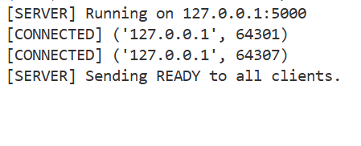
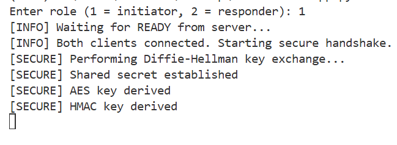
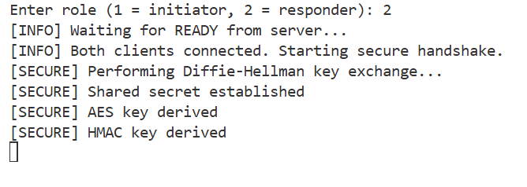

🔐 Secure Chat Application (End-to-End Encrypted)

📌 Project Description

This project implements a secure real-time chat application using End-to-End Encryption (E2EE).
Messages are encrypted on the sender’s device and decrypted only on the receiver’s device, ensuring complete confidentiality.
The server acts strictly as a blind relay, forwarding encrypted data between clients without performing encryption, decryption, or message inspection.
As a result, even a compromised server cannot read or tamper with user messages.

🏗️ System Architecture
Client A 🔐  →  Server (Blind Relay)  →  🔐 Client B
The server forwards raw encrypted bytes only
No cryptographic operations are performed on the server
All security mechanisms are implemented at the client side

🔐 Security Design & Encryption Flow
Both clients connect to the server
The server sends a READY signal when two clients are connected
Clients perform Diffie–Hellman key exchange
A shared secret is generated independently on both clients
Keys are derived from the shared secret using SHA-256
Messages are encrypted using AES (CBC mode)
An HMAC-SHA256 is attached to every encrypted message
The receiver verifies HMAC integrity before decrypting the message
This ensures confidentiality, integrity, and authenticity of communication.

🛡️ Message Integrity Using HMAC (Implemented)
In addition to encryption, the application implements HMAC (Hash-based Message Authentication Code) to ensure message integrity and authenticity.
Why HMAC Is Required
Encryption alone protects confidentiality but does not detect message tampering.
HMAC guarantees that:
Messages have not been altered in transit
Messages originate from a trusted peer who possesses the shared secret
How HMAC Is Implemented
An HMAC key is derived from the Diffie–Hellman shared secret
For every message:
The sender computes an HMAC over (IV + ciphertext)
The encrypted message and HMAC are sent together
The receiver:
Recomputes the HMAC
Verifies it before decryption
Rejects the message if integrity verification fails
This protects against tampering, replay attacks, and message forgery.

⚙️ Technologies Used
Python
socket (TCP networking)
threading
cryptography library
Diffie–Hellman key exchange
AES symmetric encryption
HMAC-SHA256 for integrity

▶️ How to Run the Project
1️⃣ Start the Server
Open a terminal in the project root directory and run:
python server/server.py
Expected output:
[SERVER] Running on 127.0.0.1:5000
2️⃣ Start Client 1 (Initiator)
Open a new terminal and run:
python client/client.py
When prompted, enter:
1
3️⃣ Start Client 2 (Responder)
Open another new terminal and run:
python client/client.py
When prompted, enter:
2
✅ Expected Output (On Both Clients)
[INFO] Waiting for READY from server...
[INFO] Both clients connected. Starting secure handshake.
[SECURE] Performing Diffie-Hellman key exchange...
[SECURE] Shared secret established
[SECURE] AES key derived
[SECURE] HMAC key derived

After this, clients can securely exchange encrypted messages.

🔐 Security Highlights
End-to-End Encryption (E2EE)
Blind relay server (zero trust server model)
Secure key exchange using Diffie–Hellman
AES encryption for confidentiality
HMAC-SHA256 for integrity and authenticity
Tamper detection before decryption

🎓 Learning Outcomes
Practical implementation of cryptographic protocols
Understanding of End-to-End Encryption
Secure client-server communication over TCP
Handling TCP stream synchronization issues
Implementing confidentiality and integrity together

 ## 📸 Screenshots

### 🖥️ Server Running Successfully

### 🔐 Client 1 – Secure Handshake

### 🔐 Client 2 – Secure Handshake

📚 Conclusion
This project demonstrates a complete and secure end-to-end encrypted communication system using industry-standard cryptographic techniques.
It highlights how confidentiality, integrity, and secure key exchange can be achieved while keeping the server fully untrusted.